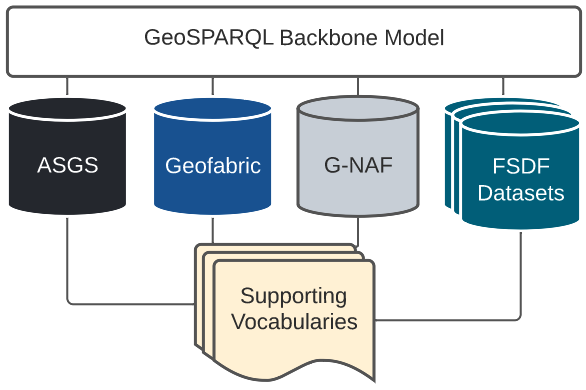

= FSDF Supermodel Specification
:toc: left
:table-stripes: even
:sectnums:

A model for the integration of the multiple models within the Australian, national, Foundational Spatial Data Framework scenario.

[[overview]]
.Overview of this Supermodel

== Metadata

[width=75%, frame=none, grid=none, cols="1,5"]
|===
|**IRI** | https://linked.data.gov.au/def/fsdf-supermodel
|**Title** | FSDF Supermodel Specifciation
|**Description** | This Model - the FSDF Supermodel - is the overarching data model that provides integration logic for all https://link.fsdf.org.au/[FSDF elements]. It is based on the general-purpose https://linked.data.gov.au/def/supermodel[Supermodel Model]. 
|**Created** | 2022-02-24
|**Modified** | 2022-08-05
|**Issued** | 2022-08-05
|**Creator** | https://linked.data.gov.au/org/ga[Geoscience Australia] & https://surroundaustralia.com[SURROUND Austraia Pty Ltd]
|**Publisher** | https://linked.data.gov.au/org/icsm[Intergovernmental Committee on Surveying & Mapping]
|**License** | https://creativecommons.org/licenses/by/4.0/[Creative Commons Attribution 4.0 International (CC BY 4.0)]
|===

include::02-preamble.adoc[]

include::02b-termsdefs.adoc[]

include::02c-conventions.adoc[]

include::04-introduction.adoc[]

include::05-supermodel.adoc[]

include::06-background-models.adoc[]

include::07-backbone-model.adoc[]

include::08-component-models.adoc[]

include::09-supporting-vocabularies.adoc[]

:sectnums!:

include::99-references.adoc[]
