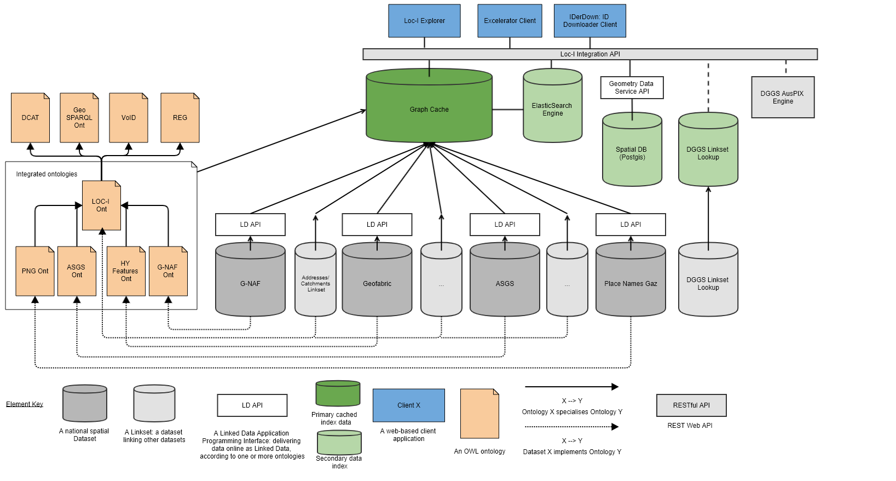

== Introduction

This Supermodel is based on previous work from the Location Index (Loc-I) Project. For clarity, that the Loc-I Project is described, followed by how this Supermodel inherits from it.

=== Loc-I Project

The Location Index (LOC-I) project, established in 2018, created a methodology, data models and an informal framework to allow for a consistent way to seamlessly integrate spatial data from distributed sources. The target was Australian spatial data "of national significance", meaning most - initially all - of the data considered was Australian Federal government data.

See the project website, http://www.ga.gov.au/locationindex, for more project information.

=== Loc-I Technical Implementation 

The technical implementation of Loc-I was based on <<semantic-web-defn, Semantic Web>> principles allowing datasets to be published as <<linked-data-defn, Linked Data>> independently, by data holders - different government departments, companies etc. - and consumed with minimal effort required for integration.

The technical implementation relied on data from the various datasets sharing common patterns, principally, how the datasets packaged their content and how real-world objects, their spatiality and non-spatial properties were modelled.to this end, a number of <<background-model-defn, Background Models>> were used, to which all Loc-I dataset models - here called <<component-model-defn, Component Models>> - conformed. Additionally, a https://linked.data.gov.au/def/loci[Loc-I Ontology] was also created which both included modelling elements needed for the LocI Project that were not present in Background Models and which was to act as a conceptual, if not technical, conformance target for all Component Models.

<<#orig-arch, Figure 2>> below shows the original detailed architecture diagram used to explain Loc-I's parts from 2018 - 2021. 

[[orig-arch]]
.Original Loc-I Detailed Architecture (from https://www.csiro.au[CSIRO])

=== Loc-I to Supermodel

The FSDF Project has adopted a more rigourously defined _Supermodel_ concept to formalise things of importance to Loc-I-like work but which the Loc-I Project didn't define. For example, the categorisation of relevant models as <<background-model-defn, Background Models>>, <<component-model-defn, Component Models>> and so on. The major differences/additions are:

* *Formalised terminology*
** Of general relevance within the implementation scenario
** See the <<Terms & Definitions>> section.
* *Model categorisation*
** For the different types of models within the scenario, for example, <<background-model-defn, Background Models>>, <<component-model-defn, Component Models>>
* *Explicit integration*
** By explicitly defining a <<backbone-model-defn, Backbone Model>> for each scenario deployment, the Supermodel conventions indicate precicely what minimum requirements for <<component-model-defn, Component Models>> are to be able to be integrated
* *Validatable profiling instead of model specailisation*
** Loc-I relied on defining an ontology to which datasets were expected to conform
** Supermodel implements a Profile of Background Models to which Component Datasets mush conform
** The Profile provides executable data validators

In addition to these model/methodological changes, this particular Spuermodel deployment has updated scenario-specific things, in particular:

* *Use of GeoSPARQL 1.1*
** The Loc-I Project motivated extensions to the GeoSPARQL 1.0 ontology which were captured in the https://linked.data.gov.au/def/geox[GeoSPARQL Extensions Ontology (GeoX)]. That ontology was then used by many Loc-I Project dataset models (Component Models)
** The update to GeoSPARQL, https://opengeospatial.github.io/ogc-geosparql/geosparql11/spec.html[GeoSPARQL 1.1], absorbed many of these updates and so there is no longer a need to use GeoX
* *Collection-based Feature organisation*
** Several Loc-I dataset models (Component Models) used specialised properties to indicate aggregations of Feature, e.g. the http://linked.data.gov.au/def/asgs[ASGS Ontology's] `aggregatesTo` & `isAggregationOf`
** The latest issue of the ASGS dataset within this Supermodel, online at https://linked.data.gov.au/dataset/asgsed3, uses only Collection membership (all Meshblock Features are members of the Meshblocks Feature Collection) and standard topological relations, e.g. each SA2 is `geo:sfWithin` an SA3
** This takes advantage of GeoSPARQL 1.1's collections which match OGC API structures and removes non-standard spatial object relations
** specialised Feature aggregations _may_ be re-added to objects within this Supermodel, if required
* *Topological querying instead of Linksets*
** Loc-I Linksets are datasets that declare topologicla relations between Features
** GeoSPARQL allows topological relationships to be calculated using topologicla functions
** Loc-I Project estableished only a limited set of Linksets, e.g. the https://github.com/CSIRO-enviro-informatics/addrmb16-linkset[Current Addresses to 2016 Mesh Blocks Linkset]
** This Supermodel deployment includes a cache of all datasets, https://cache.linked.fsdf.org.au, on which topological queries across all datasets can be performed

To conclude this Loc-I/Supermodel relations, here is a table mapping elements and terminology.

[cols="1,1,2"]
.Loc-I/FSDF Supermodel element comparison
|===
| Loc-I | FSDF Supermodel | Notes

| Upper ontologies +
_https://opengeospatial.github.io/ogc-geosparql/geosparql10/11-052r4_OGC_GeoSPARQL.pdf[GeoSPARQL 1.0], https://www.w3.org/TR/vocab-dcat/[DCAT] etc._ | <<background-model-defn, Background Models>> | The Supermodel precisely lists Background Models in <<Background Models>> where Loc-I left their discovery to general documentation or dataset model imports

| https://linked.data.gov.au/def/loci[Loc-I Ontology] & +
https://linked.data.gov.au/def/geox[GeoX Ontology]
| <<backbone-model-defn, Backbone Model>> | The Backbone Model profiles GeoSPARQL 1.1 and thus incorporates equivalent (updated) GeoX modelling. Loc-I Ontology Linksets are not used. Loc-I Ontology Datasets are replaced with Backbone Model profiling of DCAT

| Dataset models +
_https://linked.data.gov.au/def/gnaf[GNAF], https://linked.data.gov.au/def/asgs[ASGS], https://linked.data.gov.au/def/geofabric[Geofabric]_
| <<component-model-defn, Component Models>>
| The FSDF Supermodel lists the <<Component Models>> defined to be within it formally in this Supermodel document

| https://linked.data.gov.au/def/gnaf[GNAF Ontology] | https://nicholascar.com/anz-nat-addr-model-candidate/model.html[ANZ National Address Model] | The new model is a more standards-based form of the previous one and all aspects of the original model are coverd by the new

| https://linked.data.gov.au/def/asgs[ASGS Ontology] | <<Backbone Model>> | The current delivery of the ASGS at https://asgs.linked.fsdf.org.au uses no properties other than those already in the <<Backbone Model>> therefor no custom Component Model is needed

| https://linked.data.gov.au/def/geofabric[Geofabric Ontology] | unchanged | The Geofabric data online at https://geofabric.linked.fsdf.org.au currently uses only one element of the Geofabric Ontology, the property `hasDownstreamCatchment` however more use of that ontology, or an extended version of it, may be used in the future

| https://linked.data.gov.au/def/placenames[Placenames Ontology] | unchanged | While not an official original Loc-I dataset, Placenames was implemented in Loc-I style at https://fsdf.org.au/dataset/placenames/. It has been brought in to the Supermodel as a standard Component Model using the same ontology, albeit with updates

| Geometry Data Service | https://cache.linked.fsdf.org.au[Graph Cache] | Loc-I build a non-Semantic geometry data service for some cross-dataset spatial queries. Supermodel implements a total cache of all Component Models' content in semanti form for GeoSPARQL spatial querying and other semantic querying
|===

The Loc-I project also implemented a series of custom clients of the Loc-I data:

=== How to use this Supermodel

This Supermodel provides a general structure for datasets that want to integrate within the FSDF Data Platform. The common tasks you might perform with the Supermodel are:

1. Model a new dataset as an FSDF Supermodel generic dataset
2. Validate new dataset data according to the FSDF Supermodel
3. Create an extended/specialised Component Model for a dataset
4. Validate extended/specialised new dataset data according to the extended/specialised FSDF Supermodel Component Model
5. Create a dataset of observations - population/statistical or natural world - linked to Component Models

Detailed suggestions as to how to achieve these tasks are given below.

==== 1. Model a new dataset

Individual datasets are modelled as <<component-model-defn, Component Models>>. The most basic of Component Models contain `Dataset`, `FeatureCollection` & `Feature` classes modelled using the DCAT & GeoSPARQL Background Models with certain relations. The details of this modelling are given in the first part of the <<Component Models>> section.

To model a highly specialised dataset, you will need to be able to implement both the most basic Component Model elements but also model the specialised elements relevant to your dataset. No specific guidance about your dataset can be given here however the <<Component Models>> section does indicate existing datasets that contain a large amount of specialisation that you may draw inspiration from.

In all cases, you can use the tools listed in the <<Validators>> section to test any data you've created to see if it really is valid according to this Supermodel.

==== 2. Validate new dataset

Data validators are available, for all elements of this Supermodel, so you can use them to validate your data. See the <<Validators>> section.

==== 3. Create an extended/specialised 'Component Model'

As per subsection 1. above, we can't give specific details about specialised modelling here since we don't know about your particular dataset however we can both indicate existing specialised datasets (see the start of the <<Component Models>> section) and we can make a few general points:

* this Supermodel is concerned with the modelling of spatial datasets as Component Models with `Dataset`, `FeatureCollection` & `Feature` with certain relations between them
* most specialisation is likely to occur by adding special properties to `Feature` instances
** for example, the `Feature` instances within the FSDF's https://linked.fsdf.org.au/dataset/electrical-infrastructure/collections/PS[Power Stations] `FeatureCollection` contain properties relevant to power generation, such as `primaryfuelType` indicating coal, biogas etc., and these are important for knowledge of Power Stations but don't affect the general spatial feature modelling of this Supermodel in any way
* spatial relations - between `Feature` instances within one `FeatureCollection` or even across `Dataset` instances - are expected and can be modelled using GeoSPARQL's https://opengeospatial.github.io/ogc-geosparql/geosparql11/spec.html#_simple_features_relation_family[Simple Features Topological Relations Family].
** No custom modelling is likely required for standard spatial relations
* The geometries of `Feature` instances can be represented in several ways and `Feature` instances can have multiple geometries
** Boundaries at different levels of resolution may be given or geometries with different roles, e.g. high and low tide boundaries

==== 4. Validate extended/specialised new dataset data

As per section 2. above, see the <<Validators>> section. Of course, your specialised modelling won't have a validator for it, however you can certainly ensure that your new data is valid according to this Supermodel.

==== 5. Create a dataset of observations

The spatial datasets within this Supermodel are intended to just present a spatial reference later that observations data can be referenced against. For example, Australian census data is keyed to the Mesh Blocks and other spatial areas of the <<ASGS, ASGS dataset>>, water data in the Bureau of Meteorology's AWRIS system are keyed to catchments within the <<Geofabric, Geofabric dataset>>.

You can create your own observations data and key them to any datasets that exist within this Supermodel or to datasets that you make that are compatible with this Supermodel's elements.

To know how to do this, see <<Annex A: Observations Data>>.
