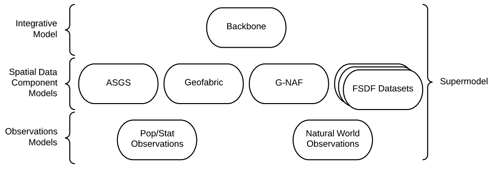
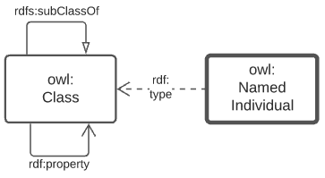
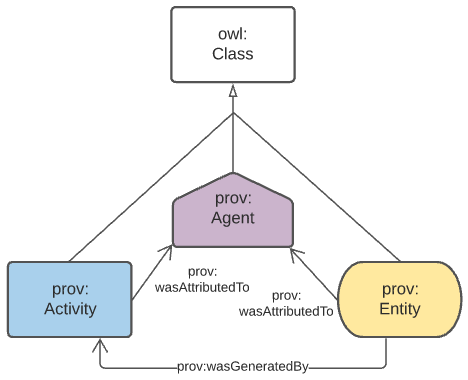

== Supermodel

[[models]]
.The various models of this Supermodel

=== Overview

This Section describes the structure of this Supermodel, aspects of the modelling involved and how to use this Supermodel. Following Sections describe the elements of the Supermodel in detail.

=== Structure

The high-level structure of this Supermodel consists of:

* <<Background Models>>
** Standard and common Semantic Web models used as "upper" or higher order/abstract model for all other Supermodel models to conform to when modelling something within the Background Model's purview.
** Models such as the Provenance Ontology <<PROV>> model provenance and all Supermodel models follow it when doing provenance work
** GeoSPARQL <<GEO>> serves as the background model for spatial objects - features and their geometries
* <<Backbone Model>>
** This is a profile of the Background Models and includes validators
** Data must conform to this model in order to be considered within this Supermodel
** This model is a bare minimu: Component Models can, and already do, extend beyond this model to cater for their specific needs
* <<Component Models>>
** These are individual models for datasets within this Supermodel
** Not all dataset require a Component Model, for example, the ASGS is currently modelled using Backbone Model elements only
* <<Supporting Vocabularies>>
** Vocabularies that support the Backbone and Component models
** They must conform to the https://w3id.org/profile/vocpub[VocPub Profile] of https://www.w3.org/TR/skos-reference/[SKOS]
** They may contain specialised elements beyond VocPub/SKOS too

Further detials of and definitions for these elements are provided in the <<Terms & Definitions>> section, above, and in the https://linked.data.gov.au/def/supermodel[Supermodel Model].

The next section deals with some aspects of how the models are created.

=== Modelling Methods

The modelling language/system used for all Supermodel elements expressed formally is the _Web Ontology Language_ <<OWL>>. OWL diagramming is used for formal model images and, when it is, this is noted in the figure description. The figure below is a key for all OWL diagramming elements.

[id=fig-level0-key]
.Diagram elements key
image::img/key.png[]

==== Object Modelling

The elements from the above subsection are shown in relation to one another in the figure below.

[id=fig-level0-owl]
.OWL objects and their relations

The elements shown above are identified with prefixed IRIs that correspond to entries in the <<#tbl-prefixes, Namespace Table>>. A short explanation of the diagram key elements is:

* `owl:Class` - represents any conceptual class of objects. Classes are expected to contain individuals - instances of the class - and the class, as a whole, may have realtions to other classes
* `owl:NamedIndividual` - an individual of an `owl:class`. For example, for the class _ships_, an individual might be _Titanic_
* `rdf:property` - a relationship between classes, individuals, or any objects and Literals
* `rdfs:subClassOf` -  an `rdf:property` indicating that the domain (from object) is a subclass of the range (to objects). An example is the class _student_ which is a subclass of _person_: all _students_ are clearly _persons_ but not _vice versa_
* `rdf:type` - the property that related an `owl:NamedIndividual` to the `owl:Class` that it's a member of
* `Literal` - a simple literal data property, e.g. the string "Nicholas", or the number 42. Specific literal types are usually indicated when used

The remaining diagrams in this document use extensions to this basic model, for example <<#fig-level0-prov, Figure 3>> uses colour-coded specialised forms of `owl:Class` (subclasses of it) and the relations in <<#fig-central-classes, Figure 5>> are specialised forms of `rdf:property`.

==== Provenance

General provenance/lineage information about anything - a rock sample, a dataset, a term in a vocabulary etc. - is described using the _Provenance Ontology_ <<PROV>> which views _everything_ in the world as being of one or more types in <<#fig-level0-prov, Figure 3>>.

[id=fig-level0-prov]
.PROV main classes and main relations

According to PROV, all things are either a:

* `prov:Entity` - a physical, digital, conceptual, or other kind of thing with some fixed aspects
* `prov:Agent` - something that bears some form of responsibility for an activity taking place, for the existence of an entity, or for another agent's activity
* `prov:Activity` - something that occurs over a period of time and acts upon or with entities

While not often in front of mind for objects in any Data Domain, provenance relations always apply, for example: a `sosa:Sample` within the _Sampling_ domain is a `prov:Entity` and will necissarily have been created via a `sosa:Sampling` which is a `prov:Activity`. Another example: an `sdo:Person` related to a `dcat:Dataset` via the property `dcterms:creator` in the _DataCataloging_ domain is a specialised form of a `prov:Agent` related to a `prov:Entity` via `prov:wasAttributedTo`.

=== Ensuring Data Conformance

First the requirements for data to conform to are described, then how to test conformance in the Validation section.

==== Conformance Requirements

Data wishing to be used within this Supermodel must conform to:

. Relevant Background Models
. The Backbone Model
. Perhaps a Component Model

===== Relevant Background Models
All data within the Supermodel will need to conform to at least _some_ Background Models. Working out which ones are relevant is done by looking at the conceptual scope of the various listed Background Models and comparing the conceptual scope of the data to them. 

For example, if the data is spatial - and most of it will be - it will need to conform to GeoSPARQL <<GEO>>. If it's observations information, Data Cube <<DQ>>.

Many Background Models are generic and have a wide scope and thus most data will need to conform to most Background Models.

For example, if the data contains provenance information, regardless of whether it's a spatial or observations dataset, it will need to conform to the Provenance Ontology <<PROV>>.

===== Backbone Model

All data will need to conform to the Backbone Model as this model is used to ensure all data can work together.

This model is only concerned with minimum requirements for data, so data conforming to this model may have any other things in it - details specific to that dataset's concern - that are un-handled/unknonw in the Backbone Model. That's fine, as long as the minimal requirements are met.

===== Component Model

Many datasets will have a Compoent Model implemented for them. If they due, obviously data within that dataset must conform to it. If no Component Model has been implemented, it means that dataset is a direct implemetation of the Backbone Model and need only conform to that.

==== Validation

To ensure that data within a dataset conforms to the models it needs to, automated validation of data must occur. This Supermodel implements validators for the Backbone Model that must be used to test data with.

This Supermodel is also either obtaining or implementing validators for all Background Models over time. Validators implemented for Background Models in this Supermodel are implemented within <<null-profile-defn, Null Profiles>> of them since most of the Background Models are previously defined controlled standards that cannot have all of the profiling elements relevant to Supermodels just added to them.

=== How to use this Supermodel

This Supermodel provides a general structure for datasets that want to integrate within the FSDF Data Platform. The common tasks you might perform with the Supermodel are:

1. Model a new dataset as an FSDF Supermodel generic dataset
2. Validate new dataset data according to the FSDF Supermodel
3. Create an extended/specialised Component Model for a dataset
4. Validate extended/specialised new dataset data according to the extended/specialised FSDF Supermodel Component Model
5. Create a dataset of observations - population/statistical or natural world - linked to Component Models

Detailed suggestions as to how to achieve these tasks are given below.

==== 1. Model a new dataset

Individual datasets are modelled as <<component-model-defn, Component Models>>. The most basic of Component Models contain `Dataset`, `FeatureCollection` & `Feature` classes modelled using the DCAT & GeoSPARQL Background Models with certain relations. The details of this modelling are given in the first part of the <<Component Models>> section.

To model a highly specialised dataset, you will need to be able to implement both the most basic Component Model elements but also model the specialised elements relevant to your dataset. No specific guidance about your dataset can be given here however the <<Component Models>> section does indicate existing datasets that contain a large amount of specialisation that you may draw inspiration from.

In all cases, you can use the tools listed in the <<Validators>> section to test any data you've created to see if it really is valid according to this Supermodel.

==== 2. Validate new dataset

Data validators are available, for all elements of this Supermodel, so you can use them to validate your data. See the <<Validators>> section.

==== 3. Create an extended/specialised 'Component Model'

As per subsection 1. above, we can't give specific details about specialised modelling here since we don't know about your particular dataset however we can both indicate existing specialised datasets (see the start of the <<Component Models>> section) and we can make a few general points:

* this Supermodel is concerned with the modelling of spatial datasets as Component Models with `Dataset`, `FeatureCollection` & `Feature` with certain relations between them
* most specialisation is likely to occur by adding special properties to `Feature` instances
** for example, the `Feature` instances within the FSDF's https://linked.fsdf.org.au/dataset/electrical-infrastructure/collections/PS[Power Stations] `FeatureCollection` contain properties relevant to power generation, such as `primaryfuelType` indicating coal, biogas etc., and these are important for knowledge of Power Stations but don't affect the general spatial feature modelling of this Supermodel in any way
* spatial relations - between `Feature` instances within one `FeatureCollection` or even across `Dataset` instances - are expected and can be modelled using GeoSPARQL's https://opengeospatial.github.io/ogc-geosparql/geosparql11/spec.html#_simple_features_relation_family[Simple Features Topological Relations Family].
** No custom modelling is likely required for standard spatial relations
* The geometries of `Feature` instances can be represented in several ways and `Feature` instances can have multiple geometries
** Boundaries at different levels of resolution may be given or geometries with different roles, e.g. high and low tide boundaries

==== 4. Validate extended/specialised new dataset data

As per section 2. above, see the <<Validators>> section. Of course, your specialised modelling won't have a validator for it, however you can certainly ensure that your new data is valid according to this Supermodel.

==== 5. Create a dataset of observations

The spatial datasets within this Supermodel are intended to just present a spatial reference later that observations data can be referenced against. For example, Australian census data is keyed to the Mesh Blocks and other spatial areas of the <<ASGS, ASGS dataset>>, water data in the Bureau of Meteorology's AWRIS system are keyed to catchments within the <<Geofabric, Geofabric dataset>>.

You can create your own observations data and key them to any datasets that exist within this Supermodel or to datasets that you make that are compatible with this Supermodel's elements.

To know how to do this, see <<Annex A: Observations Data>>.
