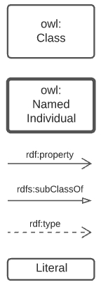
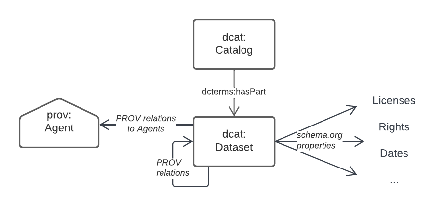
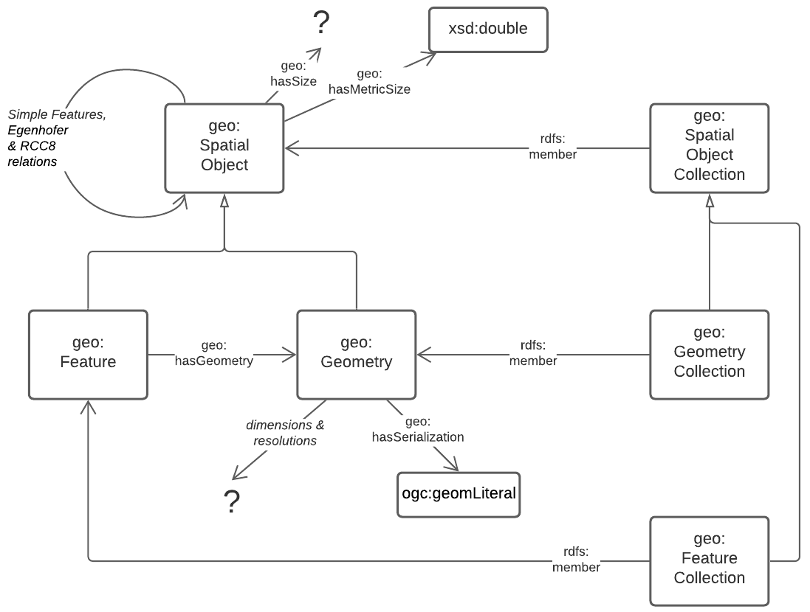
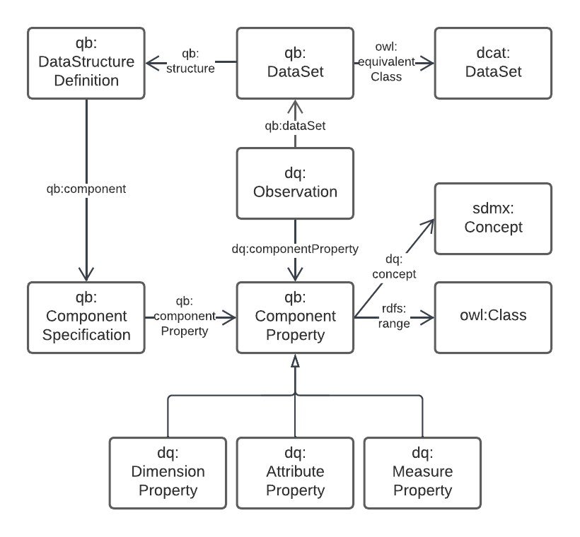
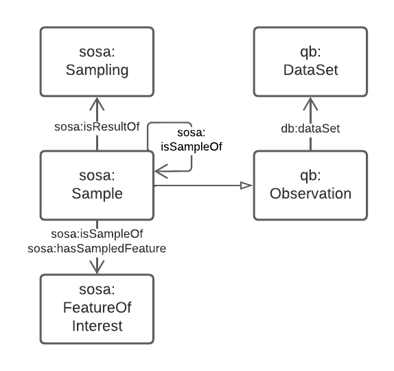
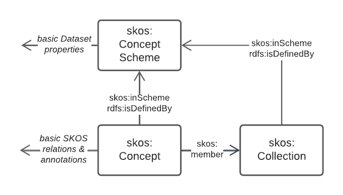

== Background Models

Background Models are:

"standard and common Semantic Web model used as "upper" or higher order/abstract model for all other Supermodel models to conform to when modelling something within the Background Model's purview."
-- <<Background Models>> definition from the <<Terms & Definitions>> section

=== List

The particular Background Models in this FSDF Supermodel are given in the table below, with a description of the conceptual area they cover indicated as 'Domain', to assist in assessment of their relevance to Supermodel data.

[id="background-models-table", cols="1,1,2"]
.Background Models
|===
| Background Model | Reference | Domain

| Web Ontology Language | <<OWL>> | General Modelling: all the other Background Models are OWL models
| schema.org | https://schema.org[schema.org] | General Modelling: Agents (People & Organisations), licensing etc.
| Data Catalog Vocabulary | <<DCAT>> | Dataset Metadata
| The Provenance Ontology | <<PROV>> | Data Metadata: attribution of data to owners/publishers etc. Data lineage: what things datasets derive from
| GeoSPARQL 1.1 | <<GEO>> | Spatiality: Feature/Geometry links, topological relations, spatial scalar values (e.g. area)
| Data Cube Vocabulary | <<QB>> | Data Dimensions: for observations data, e.g. population census
| Sensor, Observation, Sample, and Actuator (SOSA) | <<SSN>> | Data Dimensions: for spatial and natural-world data, e.g. from satellites
| Simple Knowledge Organization System | <<SKOS>> | Vocabularies
| Vocabulary Publications Profile of SKOS | <<VOCPUB>> | A profile of SKOS requiring certain properties for vocabularies and their elements
|===

=== Domain Details

The domains for each of the Background Models are noted in the table above, however here now are indicative models for each of then indicating the main classes and properties of concern within the domain.

==== General Modelling

All of the Background Models, the Backbone Model and all other Supermodel models use the Web Ontology Language, OWL, for their modelling structures. While a description of OWL is out-of-scope for this document, below is given a key for the main OWL elements seen in subsequent figures. 

[id=fig-key]
.Figure key for the OWL modelling used in subsequent Figures

OWL it itself built on <<RDF>> & <<RDFS>>, but we only reference OWL in this Background Models section as OWL "covers" these lower-level models.

==== Dataset Metadata

Metadata for datasets within this Supermodel is based on the _Data Catalog Vocabulary_ <<DCAT>> with elements of _The Provenance Ontology_ <<PROV>> for a few purposes, such as Data/Agent relations. Note that DCAT recommends this use of PROV. The figure below gives an informal overview of the concerns in this domain.

[id=fig-dataset-metadata, width="50%"]
.Data Cataloguing Model, based on DCAT & PROV

Specifics properties for dataset-level metadata, such as license, copyright notices, who the publisher is etc. are mostly taken from https://schema.org[schema.org] which is a general-purpose OWL (or at least OWL-compatable!) vocabulary of classes and properties.

schema.org is also used for Agent/Agent relations, as per the figure below.

[id=fig-agent-relations]
.Organisation Model, based on schema.org
image::img/domain-agents.png[]

==== Spatialiaty

This Supermodel's core concern of modelling spatiality is based on use of the GeoSPARQL 1.1 Standard <<GEO>> which concerns itself with the elements in the figure below. The figure is a part reproduction of GeoSAPRQL's overview diagram.

[id=fig-spatiality, width="70%"]
.Classes and properties of the GeoSPARQL model from <<GEO>>, Figure 3

Essentially all spatial relations between objects and the associations of objects with spatiality (Features with Geometries) and the details of Geometry data are defined by GeoSPARQL.

==== Data Dimensions

The dimensions of data are, in general, modelled in relation to observations according to the _Data Cube Vocabulary_ <<QB>>, however the dimensions (observable properties) of spatial and real-world objects is modelled using _Sensor, Observation Sampling & Actuation_ (SOSA) ontology within the _Semantic Sensor Networks_ <<SSN>> standard. SOSA is, within this Supermodel at least, a domain-specailised version of QB.

[id=fig-observations, width="60%"]
.Observations Model, based on https://www.w3.org/TR/vocab-data-cube/#fig-pictorial-summary-of-key-terms-and-their-relationship[Data Cube Vocabulary overview]

[id=fig-spatial-observations, width="40%"]
.Observations Model for Spatial & Real-World Features

The separate modelling for spatial/real-world features' properties is due to widespread use of SOSA for observations in that domain, for example the Geoscience Australia Samples catalogue (http://sss.pid.geoscience.gov.au/sample/).

The net effect of both QB and SOSA is to define data types for and observable properties/dimensions that observations are of. 

==== Vocabularies

Many of the models in this Supermodel rely on vocabularies of individual items, for example Data/Agent relations rely on vocabularies of Agent roles. When vocabularies are modelled, this Supermodel uses a profile of the Simple Knowledge Organization System, <<SKOS>>, called VocPub <<VOCPUB>>. VocPub just requires certain metadata, allowed by bot not mandated by SKOS, to be present within vocabularies for data management purposes. At a whole-of-vocabulary level, VocPub requires versy similar metadata to DCAT, thus a Vocabulary appears as a form of Dataset.

All of the current FSDF vocabularies at https://linked.fsdf.org.au/vocab conform to VocPub.

[id=fig-vocabularies, width="50%"]
.Basic SKOS/VocPub data model

