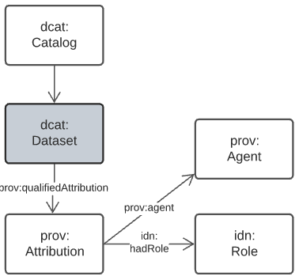
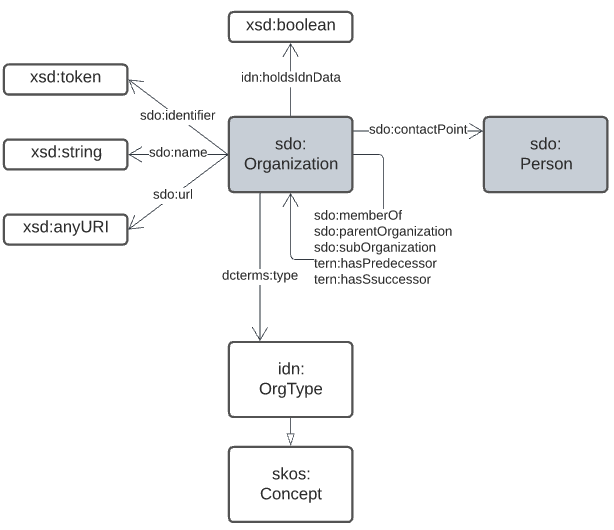

== Background Models

Background Models are:

"standard and common Semantic Web model used as "upper" or higher order/abstract model for all other Supermodel models to conform to when modelling something within the Background Model's purview."
-- <<Background Models>> definition from the <<Terms & Definitions>> section

The particular Background Models in this FSDF Supermodel are given in the table below with notes on the conceptual areas they cover to assist in assessment of their relevance to Supermodel data.

* Web Ontology Language <<OWL>>
* _Data Catalog Vocabulary_ <<DCAT>>
* _The Provenance Ontology_ <<PROV>>
* https://schema.org[schema.org]
* Data Cube Vocabulary <<DQ>>
* Simple Knowledge Organization System <<SKOS>>
* Sensor, Observation, Sample, and Actuator (SOSA) <<SSN>>
* Vocabulary Publications Profile of SKOS <<VOCPUB>>

=== Data Cataloguing Domain

This model is based on the _Data Catalog Vocabulary_ <<DCAT>> and _The Provenance Ontology_ <<PROV>> with extensions to cater for mappings to FAIR <<FAIR>> and CARE <<CARE>> models. The essential model is shown in <<datacataloguing-model, Figure 8>>.

[id=datacataloguing-model]
.Data Cataloguing Model, based on DCAT & PROV

=== Organisations & People Domain

This domain is essentially the organization modelling element of https://schema.org[schema.org] with a few additional properties to track some aspects of organisations relevant to data governance. The essential model is shown in <<org-model, Figure 10>>.

[id=org-model]
.Organisation Model, based on schema.org

=== Theming Domain

_still to come_

=== Sampling & Observations Domain

This domain is essentially the Data Cube Vocabulary <<DQ>>'s core elements with dataset metadata replaced with elements from DCAT <<DCAT>>. The essential model is shown in <<obs-model, Figure 9>>.

[id=obs-model]
.Observations Model, based on https://www.w3.org/TR/vocab-data-cube/#fig-pictorial-summary-of-key-terms-and-their-relationship[Data Cube Vocabulary overview]
image::img/details-observations-sampling.png[]

=== Spatiality Domain

The Spatiality domain is the promary concern of the FSDF Project since the project aims to provide an integration mthdology, models and an integrated and estensible "spine" of major national spatial datasets.

